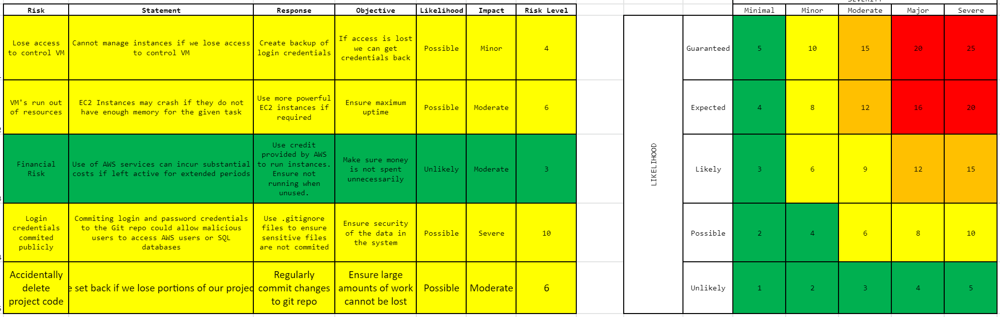
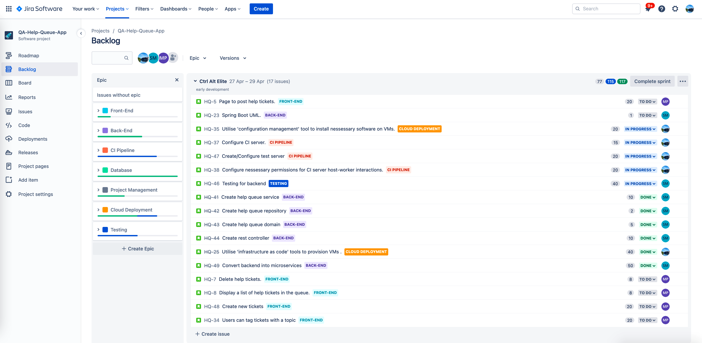
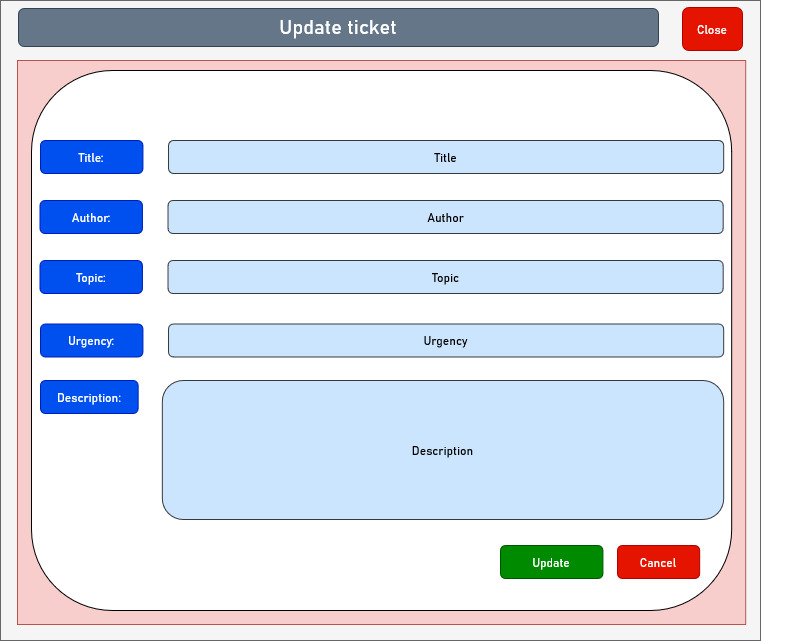
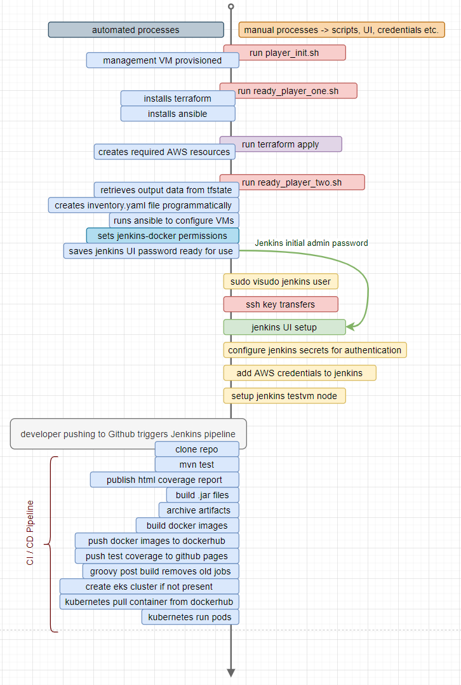

# QA-Help-Queue-App
A functional Spring Boot help queue web application deployed using a continuous integration pipeline.

---
# Table of contents

* [Introduction](#Introduction)
* [Requirements](#Requirements)
* [Constraints](#Constraints)
* [Planning](#Planning)
* [Backend UML](#Backend-UML)
* [Manual and Automated Processes](#Manual-and-Automated-Processes)
* [CI Pipeline](#CI-Pipeline)
* [Testing](#Testing)
* [Possible future extensions](#Possible-future-extensions)
* [Frameworks used](#Frameworks-used)
* [Acknowledgements and contributors](#Acknowledgements-and-contributors)
* [Licencing](#Licencing)
* [Version-control](#Version-control)

## **Introduction**
This project required us to create a fully functional CRUD Spring Boot web application which is built, tested and deployed by a continuous integration pipeline. More specifically, we were tasked to create a Help Queue which monitors who needs help with what issue in the class.

We had to create a queue that displays tickets in two segmented lists: completed and pending. For each ticket, we needed to have a minimum of title, author, description and time created. Futhermore, we had to make sure that users could create, read update and delete tickets.  In addition to this we implemented a few features into our application. We allowed users to tag each ticket with a topic. We also allowed them to choose an urgency level. The topic, the urgency level and the author can all be filtered by users of the page. The user can also search for keywords from the title and/or description which returns a particular set of results.

As an extension, we implemented a trainer and a trainee mode which lets trainers delete tickets and mark them as done. Trainees can create and update tickets.

## **Requirements**
* Jira board will all tasks needed to complete the project
* Application deployed using containerisation and orchestration tools
* Application must be tested through the CI pipeline
* The project must make use of two managed database servers. One for testing and one for production
* Webhooks must be used so that Jenkins automatically deploys the updated application
* The infrastructure for the project should be configured using an infrastructure management tool
* The project must use an Anisible Playbook that provisions the environment for the CI server.
* The project must make use of a reverse proxy to make your application accessible to the user.
* 

## **Constraints**
These are the technologies that were used:
* Kanban Board: Jira
* Version Control: Git
* CI Server: Jenkins
* Configuration Management: Ansible
* Cloud Server: AWS EC2
* Database Server: AWS RDS
* Containerisation: Docker
* Reverse Proxy: NGINX
* Orchestration Tool: Kubernetes using AWS EKS
* Infrastructure Management: Terraform
* Web framework: Spring Boot
* Frontend UI: React

## **Planning**
Below are the planning steps undertaken before development of our application:\

### Entity Relationship Diagram
 
### Architecture
Diagram used to develop our CI Pipeline:\
 

AWS Network architecture:\
 
### Risk Assessment
Below is our risk assessment:\

### Jira Board

Below are screenshots of our Jira board:\

### Wireframes
Below are the inital wireframes for our frontend:\

## **Backend UML**

## **Manual and Automated Processes**

## **CI Pipeline**

## **Testing**
The testing for our Frontend and Backend was carried out by JEST and JUNIT respectively.

Our CI pipeline generates test coverage reports for the backend that can be found here: https://jenkins-spice-latte.github.io/QA-Help-Queue-App/
Coverage for each service in the backend is over 90%.

Below is a screenshot of our frontend testing results carried out by JEST:\

## Possible future extensions
In the future, this web application can be extended in numerous ways. One way is to implement a login system that allows users to login as trainers or trainees. The trainees can then update only their own ticket. This also prevents the misuse of the trainee/trainer toggle button. Additionally, the web application can also be extended to be sorted by time and title and can also include cohorts. The application can be designed in a way that lets trainers see all cohorts but lets trainees only see theirs.

## **Frameworks used**
For this project, we made use of several icons within React. We used [React icons](https://react-icons.github.io/react-icons/) for this. In particular, we used icons from [Font Awesome](https://fontawesome.com/) and [Bootstrap](https://github.com/twbs/icons). We adapted the icons we used to suit our preferences.

## **Acknowledgements and contributors**
Throughout this project, we were guided by the trainers at the QA academy. This project was a team project and was contributed to and completed by solely by our team members:\
* [Manish Reddy](https://github.com/mani-sh-reddy)
* [Moksh Pandya](https://github.com/MP-Prime)
* [Sonny Milbourn](https://github.com/SonnyRLM)

## **Version control**
We used Github for version control in our project and used Git extensively to ensure that we save each checkpoint we reach so we can access a history of our code if we need to and so we can revert to an older version of the project if anything does go wrong. As we worked in a team, we implemented the feature branch model in our repository to ensure we can work smoothly on the project as a team.

## **Licencing**
This code is made available under the [MIT license](LICENSE).